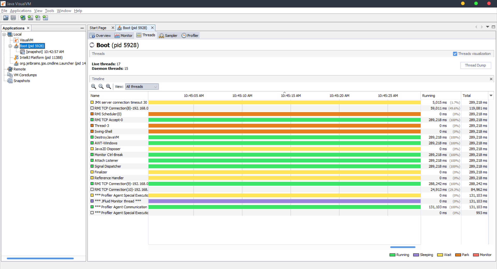
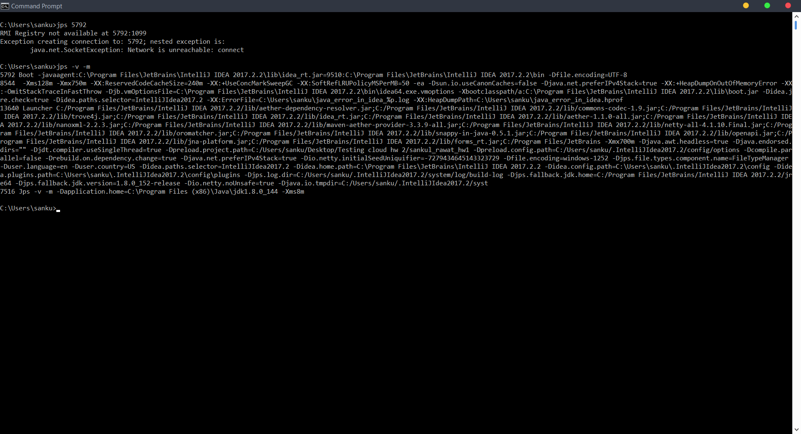

Cloud Computing HW 1
======

Link to the application repository which is being used:
[Botnak repo](https://github.com/Gocnak/Botnak)

# Description
I use junit tests to test the above mentioned application. 
Then, I use gradle and sbt to build and run those tests. 
The gradle and sbt automate the process of managing dependencies. 
In junit tests I test the utilities that the application uses to perform it's core functionality. 
The limitations of the implementation are that it only checks a very precise scope of the application. 
As only unit testing can be performed using junit, it does not help in black box testing and only covers some scope in white box testing.    

# Requirements
You will need the latest version of Java 8 to run tests. [Download it here.](http://www.oracle.com/technetwork/java/javase/downloads/jre8-downloads-2133155.html)

You will also require intellij ide. [Download it here.](https://www.jetbrains.com/idea/download/#section=windows)

Junit and other dependencies will be automatically added using gradle and sbt.

# How to run the project
1. Copy the repo clone "https://sankul@bitbucket.org/sankul/sankul_rawat_hw1.git".
2. Open intelliJ.
3. In intellij, open project using version control -> git.
4. Follow on screen instructions to clone and import project.
5. Once the project is open, open terminal window inside intellij.
6. To run using gradle, execute following command `gradle build` in terminal, this will build the project and run tests.
7. To run the tests again execute `gradle clean test` in terminal again.
8. To run using sbt, execute following command `sbt clean compile test` in terminal, this will compile and run the tests.    

# Location of tests
1. The junit tests are present on path `sankul_Rawat_hw1/src/test/java/` .
2. build.gradle and build.sbt files are present in the root directory of the project.

# Testing of application
Following monitoring tools were used to test the application [Tools list](https://docs.oracle.com/javase/8/docs/technotes/guides/troubleshoot/tooldescr025.html) 

###JConsole
I use JConsole to monitor performance and resource consumption of java applications that are running.

Screenshots of JConsole output for this application:

###VisualVM
I use VisualVM to profile the performance and resource consumption of the java application.

Screenshots of VisualVM output for this application:

###VisualGC
I use VisualGC to collect and graphically display garbage collection, class loader, and HotSpot compiler performance data.

Screenshots of VisualGC output for this application:

###Java Mission Control
I use Java Mission Control to collect and analyse detailed low level information about how the Java Virtual Machine (JVM) and the Java application are behaving.

Screenshots of Java Mission Control output for this application:

###jStack
I use jstack to print Java stack traces of Java threads for a given Java process i.e. the application.

Screenshots of jStack output for this application:

###jcmd
I use jcmd to send diagnostic command requests to the JVM, and diagnose JVM and Java Application.

Screenshots of jcmd output for this application:

###jmap
I use jmap to print shared object memory maps or heap memory details of the application.

Screenshots of jmap output for this application:

###jps
I use jps to report information on JVM.

Screenshots of jps output for this application:

###jstat
I use jstat to display performance statistics for the JVM.

Screenshots of jstat output for this application:

